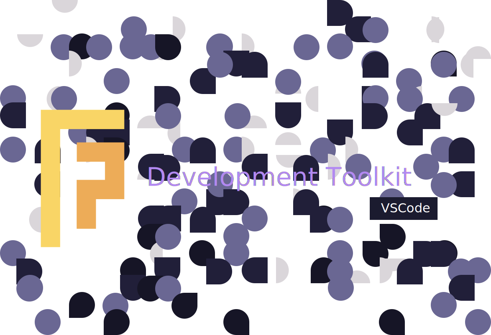

An open source, high quality DX focused toolkit for VSCode.

[VSCode Marketplace](https://marketplace.visualstudio.com/items?itemName=foretag.development-toolkit)

This is a monorepository consisting the following packages:

- Development Toolkit - Extension Pack
- Themes
- Icons
- Rust Toolkit - targets

This toolkit is heavily inspired by our technology stack, which can be found on [Stackshare](https://stackshare.io/foretag/foretag), and updates will be made in parallel to any changes in our stack to provide our employees and contributors the best possible development experience. All batteries are included: extensions, themes, languages, snippets and more.

